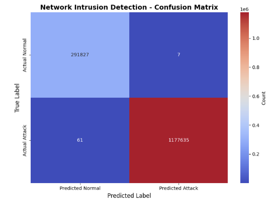
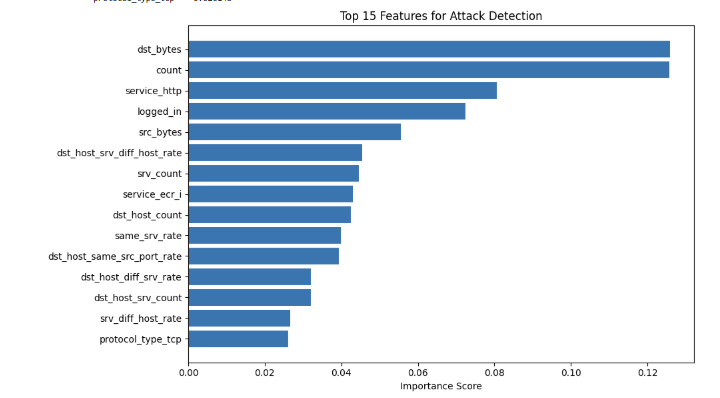

#Network Anomaly Detection using Machine Learning

## Overview

This project demonstrates the use of machine learning to detect anomalous network traffic. A classification model was developed, trained, and evaluated using network traffic data to distinguish between normal and malicious network activity.

The project focuses on applying machine learning techniques to support network intrusion detection and improve cybersecurity monitoring.

---

## Technologies

- Python
- Jupyter Notebook
- Scikit-learn
- Pandas
- NumPy
- Matplotlib

---

## Skills Demonstrated

- Machine Learning
- Network Security
- Intrusion Detection
- Data Preprocessing
- Model Training
- Model Evaluation
- Feature Analysis
- Cybersecurity Analytics

---

## Results

### Network Confusion Matrix



---

### Feature Importance



---
## Files

- 📓 [Open Jupyter Notebook](Lab3_Network_Anomaly_Detection.ipynb)
- 🐍 [Python Source Code](Lab3_Network_Anomaly_Detection.py)
- 📄 [Reflection Paper](Lab3_Network_Anomaly_Detection_reflection.docx)
---

## Python Source Code

<div class="terminal-header">
<span class="terminal-dot"></span>
<span class="terminal-dot"></span>
<span class="terminal-dot"></span>
<span class="terminal-title">Lab3_Network_Anomaly_Detection.py</span>
</div>

```python
# Imports
import pandas as pd
import numpy as np
import warnings
import os

warnings.filterwarnings("ignore")

# Confirm working directory and available files
print("Working directory:", os.getcwd())
print("Files in directory:", os.listdir())

# Column names for KDD Cup 99 dataset (CSV has NO header)
columns = [
    "duration", "protocol_type", "service", "flag", "src_bytes",
    "dst_bytes", "land", "wrong_fragment", "urgent", "hot",
    "num_failed_logins", "logged_in", "num_compromised", "root_shell",
    "su_attempted", "num_root", "num_file_creations", "num_shells",
    "num_access_files", "num_outbound_cmds", "is_host_login",
    "is_guest_login", "count", "srv_count", "serror_rate",
    "srv_serror_rate", "rerror_rate", "srv_rerror_rate",
    "same_srv_rate", "diff_srv_rate", "srv_diff_host_rate",
    "dst_host_count", "dst_host_srv_count",
    "dst_host_same_srv_rate", "dst_host_diff_srv_rate",
    "dst_host_same_src_port_rate", "dst_host_srv_diff_host_rate",
    "dst_host_serror_rate", "dst_host_srv_serror_rate",
    "dst_host_rerror_rate", "dst_host_srv_rerror_rate",
    "label"
]

# LOAD DATASET
# The actual filename on disk is: kddcup_data.csv
df = pd.read_csv(r"C:\Aicybersec\kddcup_data.csv", names=columns)

# Remove trailing period from labels (KDD Cup quirk)
df["label"] = df["label"].str.strip(".")

# ===============================
# Sanity Checks / Exploration
# ===============================

print("\nDataset shape:")
print(df.shape)

print("\nFirst 5 rows:")
display(df.head())

print("\nLabel distribution (top 10):")
print(df["label"].value_counts().head(10))

print("\nData types summary:")
print(df.dtypes.value_counts())

# ===============================
# Part 2: Feature Engineering
# One-Hot Encoding Categorical Features
# ===============================

# Identify categorical columns
categorical_cols = ["protocol_type", "service", "flag"]

print("Categorical features and number of unique values:")
for col in categorical_cols:
    print(f"{col}: {df[col].nunique()} unique values")

# Apply one-hot encoding
df_encoded = pd.get_dummies(df, columns=categorical_cols, drop_first=True)

print("\nOriginal number of features:", len(df.columns))
print("After one-hot encoding:", len(df_encoded.columns))

# Separate features and target
X = df_encoded.drop("label", axis=1)
y = df_encoded["label"]

print("\nFeature matrix shape:", X.shape)
print("Target vector shape:", y.shape)

from sklearn.model_selection import train_test_split
import numpy as np

# Create binary target: 0 = normal, 1 = attack
# KDD Cup 99 uses 'normal' as the normal class; everything else is an attack
y_binary = (y != "normal").astype(int)

# Train-test split with stratification to maintain normal vs attack ratio
X_train, X_test, y_train, y_test = train_test_split(
    X,
    y_binary,
    test_size=0.3,
    random_state=42,
    stratify=y_binary
)

print(f"Training set: {X_train.shape[0]} samples")
print(f"Test set: {X_test.shape[0]} samples")

print(f"\nTraining set attack rate: {y_train.mean():.2%}")
print(f"Test set attack rate: {y_test.mean():.2%}")

from sklearn.ensemble import RandomForestClassifier
import time
# Initialize Random Forest
clf = RandomForestClassifier(
n_estimators=100, # 100 decision trees
max_depth=20, # Limit tree depth to prevent overfitting
random_state=42,
n_jobs=-1, # Use all CPU cores
verbose=1 # Show progress
)
# Train and time
print('Training Random Forest...')
start_time = time.time()
clf.fit(X_train, y_train)
training_time = time.time() - start_time
print(f'\nTraining completed in {training_time:.2f} seconds')
print('Model ready for predictions!')

# ===============================
# Part 5: Model Evaluation
# ===============================

from sklearn.metrics import classification_report, confusion_matrix, accuracy_score

# Make predictions
y_pred = clf.predict(X_test)

# Overall accuracy
accuracy = accuracy_score(y_test, y_pred)
print(f"Overall Accuracy: {accuracy:.4f} ({accuracy*100:.2f}%)")

# Detailed classification report
print("\nClassification Report:")
print(classification_report(
    y_test,
    y_pred,
    target_names=["Normal (0)", "Attack (1)"]
))

# Confusion matrix
cm = confusion_matrix(y_test, y_pred)

print("\nConfusion Matrix:")
print(cm)

# Extract confusion matrix values
tn, fp, fn, tp = cm.ravel()

print(f"\nTN={tn}, FP={fp}, FN={fn}, TP={tp}")

import matplotlib.pyplot as plt
import seaborn as sns
%matplotlib inline
plt.figure(figsize=(8, 6))
sns.heatmap(cm, annot=True, fmt='d', cmap='coolwarm',
xticklabels=['Predicted Normal', 'Predicted Attack'],
yticklabels=['Actual Normal', 'Actual Attack'],
cbar_kws={'label': 'Count'})
plt.xlabel('Predicted Label', fontsize=12)
plt.ylabel('True Label', fontsize=12)
plt.title('Network Intrusion Detection - Confusion Matrix', fontsize=14,
fontweight='bold')
plt.tight_layout()
plt.show()

# Get feature importances
feature_importance = pd.DataFrame({
'feature': X.columns,
'importance': clf.feature_importances_
}).sort_values('importance', ascending=False)
# Top 15 features
top_features = feature_importance.head(15)
print('Top 15 Most Important Features:')
print(top_features.to_string(index=False))
# Visualize
plt.figure(figsize=(10, 6))
plt.barh(range(len(top_features)), top_features['importance'])
plt.yticks(range(len(top_features)), top_features['feature'])
plt.xlabel('Importance Score')
plt.title('Top 15 Features for Attack Detection')
plt.gca().invert_yaxis()
plt.tight_layout()
plt.show()

from sklearn.decomposition import PCA
# Reduce to 20 principal components
pca = PCA(n_components=20, random_state=42)
X_train_pca = pca.fit_transform(X_train)
X_test_pca = pca.transform(X_test)
print(f'Explained variance: {pca.explained_variance_ratio_.sum():.2%}')
# Train on reduced features
clf_pca = RandomForestClassifier(n_estimators=100, random_state=42,
n_jobs=-1)
clf_pca.fit(X_train_pca, y_train)
y_pred_pca = clf_pca.predict(X_test_pca)
print(f'PCA Model Accuracy: {accuracy_score(y_test, y_pred_pca):.4f}')

from sklearn.linear_model import LogisticRegression
from sklearn.svm import SVC
from sklearn.ensemble import GradientBoostingClassifier
from sklearn.metrics import accuracy_score

# Sample a smaller subset for faster training
sample_size = 10000
X_sample = X_train[:sample_size]
y_sample = y_train[:sample_size]

models = {
    "Logistic Regression": LogisticRegression(max_iter=1000),
    "Gradient Boosting": GradientBoostingClassifier(n_estimators=50)
}

for name, model in models.items():
    model.fit(X_sample, y_sample)
    y_pred_model = model.predict(X_test)
    acc = accuracy_score(y_test, y_pred_model)
    print(f"{name}: {acc:.4f}")
```

---

## Project Workflow

1. Load and preprocess the network dataset.
2. Clean and prepare the data for training.
3. Train the machine learning classification model.
4. Evaluate model performance.
5. Generate a confusion matrix.
6. Analyze feature importance.
7. Test the model's ability to identify anomalous network traffic.

---

## Future Improvements

- Evaluate additional machine learning algorithms.
- Perform hyperparameter tuning.
- Test against larger and more diverse datasets.
- Implement real-time anomaly detection.
- Compare supervised and unsupervised detection approaches.

---

## Disclaimer

This project was completed in an authorized academic environment for educational purposes.
